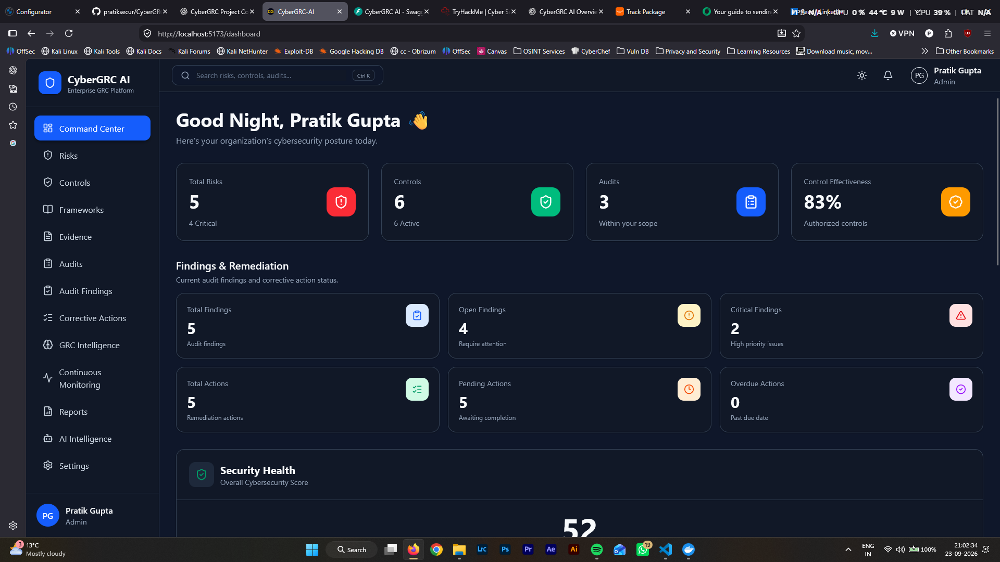
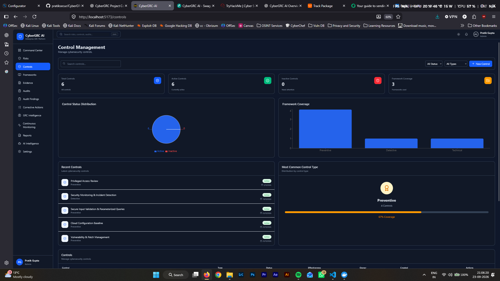
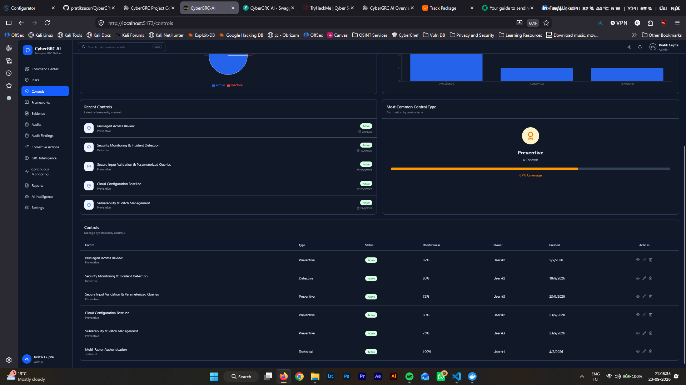
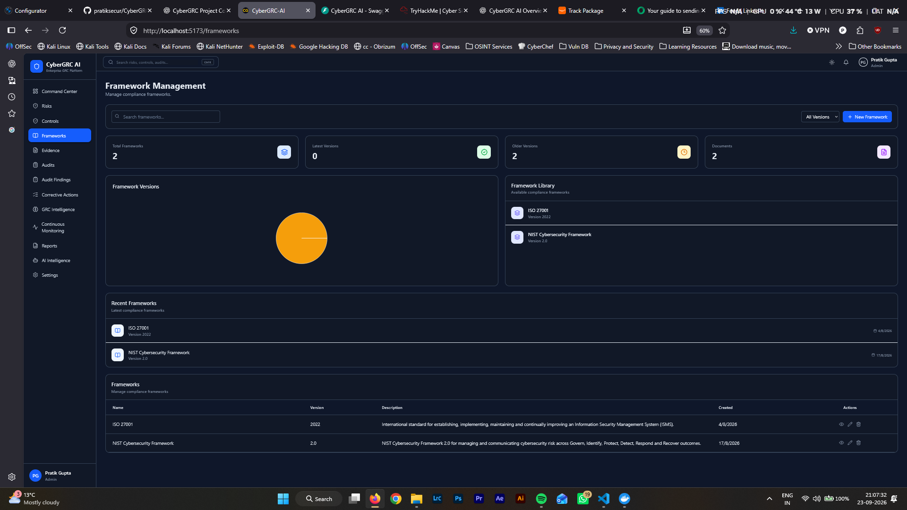
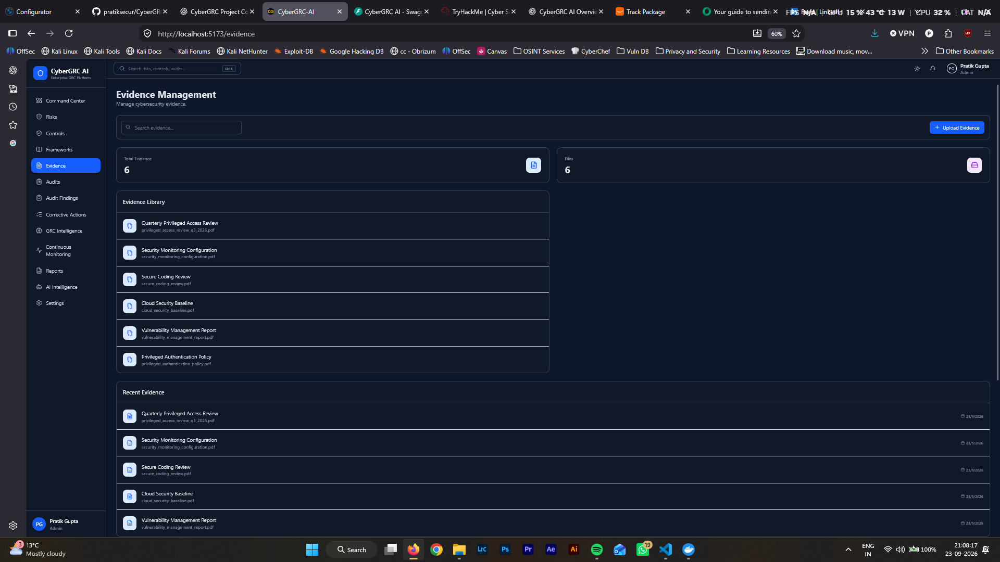
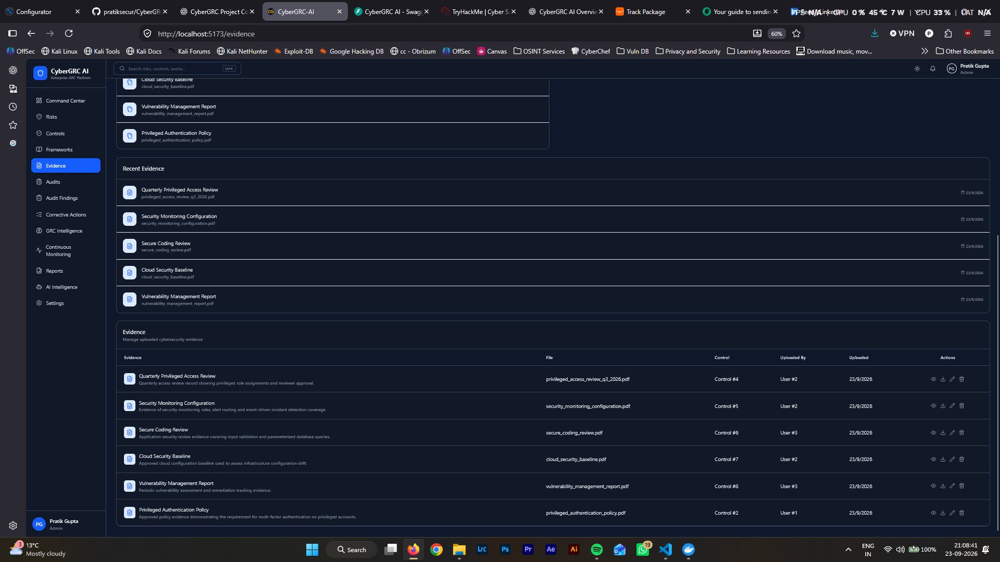
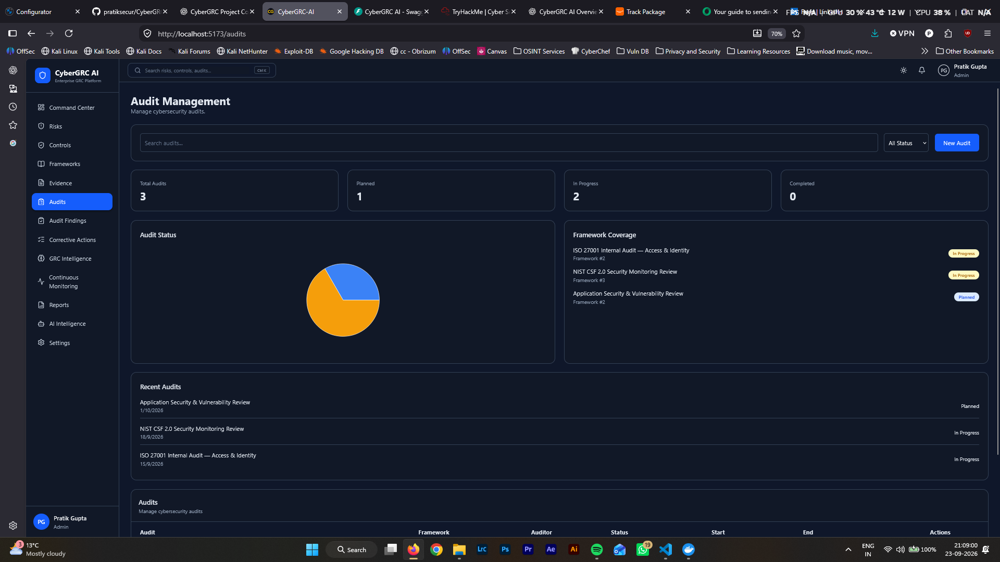
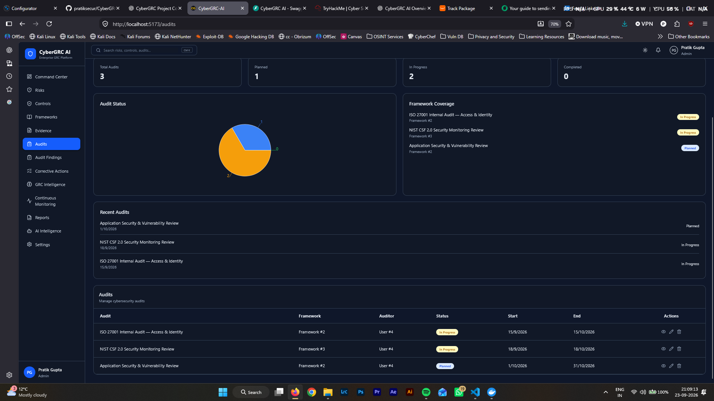
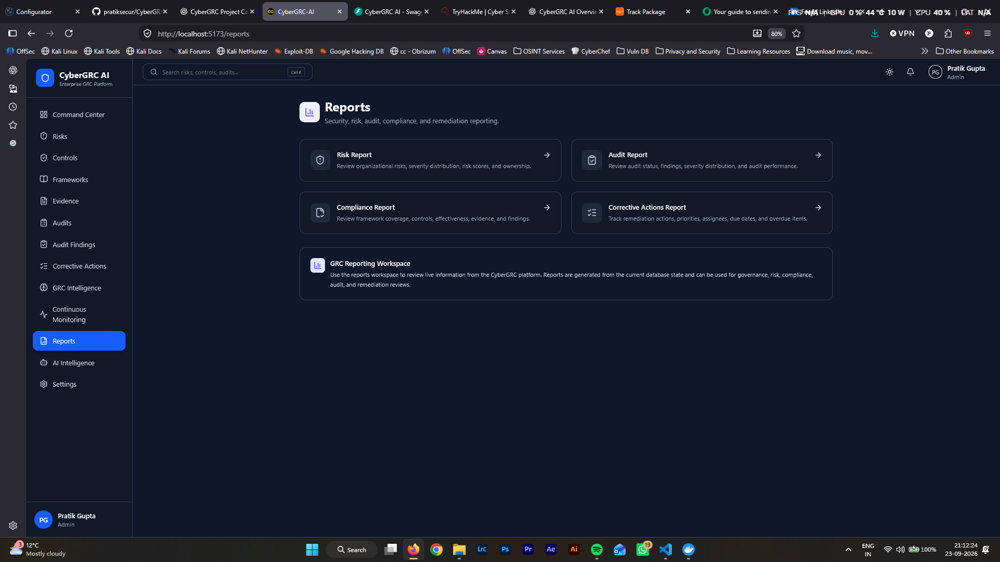

# 🛡️ CyberGRC-AI

### AI-Driven Governance, Risk & Compliance Platform

CyberGRC-AI is an AI-assisted Governance, Risk & Compliance (GRC) platform designed to connect **risk, controls, evidence, audits, findings, corrective actions, risk treatments and continuous monitoring** into a unified security and compliance lifecycle.

The project is being developed with a strong focus on **security engineering, fine-grained authorization, organizational visibility, risk intelligence and AI-assisted decision support**.

The long-term goal is to move beyond static GRC records toward **continuous risk understanding**.

---

## 🚀 Project Overview

Traditional GRC platforms often store risks, controls, evidence, audits and compliance information as separate records.

CyberGRC-AI is designed around the idea that these elements should be connected.

A risk should not exist in isolation.

It should be possible to understand:

> What risks exist?

> What controls address them?

> What evidence supports those controls?

> What findings or remediation activities are associated with the risk?

> How has the risk been treated?

> What is the resulting residual risk?

> Has anything changed that should cause the risk to be reassessed?

CyberGRC-AI brings these relationships together and uses deterministic GRC logic alongside AI-assisted analysis.

---

# 🎯 Problem Statement

Organisational security and compliance information is often distributed across different systems and processes.

Security teams may work with:

- Security events
- Vulnerabilities
- Logs
- Incident data
- Security controls

While GRC teams may work with:

- Risks
- Policies
- Controls
- Evidence
- Audits
- Findings
- Corrective actions
- Compliance frameworks

This creates a gap between:

**what is happening operationally**

and

**what it means from a risk, governance and compliance perspective.**

CyberGRC-AI explores how these domains can be connected through a unified GRC intelligence layer.

---

# 🧠 Core Capabilities

## 1. Risk Management

CyberGRC-AI provides structured risk management capabilities including:

- Risk identification
- Risk scoring
- Likelihood and impact assessment
- Risk ownership
- Risk status
- Risk-control relationships
- Risk intelligence
- Residual risk analysis
- Risk monitoring

---

## 2. Risk Treatment & Residual Risk

Risks can move through a structured treatment lifecycle:

```text
Risk
 ↓
Treatment
 ↓
Approval
 ↓
Residual Risk
 ↓
Monitoring
```

Supported treatment concepts include:

- Mitigate
- Accept
- Transfer
- Avoid
- Treatment plans
- Treatment ownership
- Target dates
- Approval workflows
- Acceptance reasoning
- Residual likelihood
- Residual impact
- Residual risk

Treatment decisions are incorporated into risk intelligence, monitoring and reporting.

The platform also uses deterministic treatment-authority logic to determine which treatment represents the current authoritative residual-risk state.

---

# 🔐 RBAC & Authorization

Security is treated as a core architectural requirement.

CyberGRC-AI implements fine-grained authorization rather than relying only on authentication.

The authorization model includes:

- Role-Based Access Control (RBAC)
- Permission-based authorization
- Object-level authorization
- Ownership checks
- Organizational visibility
- Hierarchical access
- Least-privilege principles
- AI authorization
- Resource-specific access validation

### Roles

| Role | Purpose |
|---|---|
| Admin | Full organizational administration |
| GRC Manager | GRC management and executive intelligence |
| Risk Analyst | Risk and control management |
| Auditor | Audit and compliance visibility |
| Employee | Limited own-resource access |

### Organizational Visibility

Access can be scoped according to:

```text
OWN
SUBORDINATES
ORGANIZATION
```

Being authenticated does not automatically mean a user can access every resource.

Authorization is evaluated according to the user's role, permissions, organizational relationship and the specific resource being accessed.

---

# 🛡️ Security Engineering

CyberGRC-AI has been developed with security controls throughout the application architecture.

Security considerations include:

- Least privilege
- Object-level authorization
- IDOR/BOLA prevention
- Organizational access boundaries
- Authentication and JWT security
- Password security
- Input validation
- Secure resource visibility
- AI authorization
- Auditability
- Error handling
- Security headers
- Content Security Policy
- Request size limits
- Request correlation IDs
- Controlled CORS
- Secure defaults

The API follows explicit authorization semantics:

```text
401 → Authentication failure

403 → Authenticated but not authorized

404 → Resource is outside the user's visibility scope
```

---

# 🧠 GRC Intelligence

CyberGRC-AI connects multiple GRC domains into a unified intelligence layer.

The platform currently connects:

```text
Risks
Controls
Evidence
Audits
Findings
Corrective Actions
Risk Treatments
```

This allows the system to derive relationships such as:

```text
Risk
 ├── Controls
 │    └── Evidence
 │
 ├── Findings
 │    └── Corrective Actions
 │
 └── Risk Treatment
      └── Residual Risk
```

The objective is to provide contextual risk intelligence rather than isolated database records.

---

# 🤖 AI-Assisted GRC

AI is used as an **analysis and decision-support layer**.

The project uses local LLM infrastructure through **Ollama**.

AI-assisted capabilities include:

- Risk analysis
- Control recommendations
- GRC intelligence
- Executive summaries
- Security/compliance analysis
- Risk explanations
- Decision support

AI does not replace deterministic authorization or governance rules.

The architecture intentionally separates:

```text
Deterministic Security & Governance
                +
        AI Decision Support
```

Authorization, visibility and governance boundaries remain enforced by application logic.

---

# 📊 Continuous Monitoring

CyberGRC-AI includes continuous monitoring capabilities designed to connect GRC state with operational changes.

Monitoring can surface events related to:

- Critical risks
- Risk changes
- Audit findings
- Open findings
- Corrective actions
- Critical remediation
- Risk treatment state
- Residual risk

The broader goal is to move from:

```text
Periodic GRC Assessment
```

toward:

```text
Continuous Risk Understanding
```

---

# 📋 Audits, Findings & Corrective Actions

The platform supports the lifecycle from audit observations to remediation.

```text
Audit
 ↓
Finding
 ↓
Corrective Action
 ↓
Remediation
 ↓
Risk State
```

This provides traceability between compliance activities and the risks they affect.

---

# 📚 Compliance & Framework Support

CyberGRC-AI is designed to work across multiple cybersecurity and regulatory frameworks.

The platform currently targets integration with frameworks and regulations including:

- ISO/IEC 27001
- NIST CSF
- GDPR
- NIS2
- DORA

Frameworks can be connected to controls and risks to support compliance mapping and analysis.

---

# 🏗️ Architecture

High-level architecture:

```text
                         ┌──────────────────────┐
                         │      React UI        │
                         │   TypeScript / Vite  │
                         └──────────┬───────────┘
                                    │
                                    ▼
                         ┌──────────────────────┐
                         │       FastAPI        │
                         │      REST API        │
                         └──────────┬───────────┘
                                    │
              ┌─────────────────────┼─────────────────────┐
              │                     │                     │
              ▼                     ▼                     ▼
       ┌─────────────┐      ┌──────────────┐      ┌─────────────┐
       │    RBAC     │      │     GRC      │      │     AI      │
       │ Authorization│      │ Intelligence │      │   Ollama    │
       └─────────────┘      └──────────────┘      └─────────────┘
              │                     │                     │
              └─────────────────────┼─────────────────────┘
                                    ▼
                         ┌──────────────────────┐
                         │     PostgreSQL       │
                         │      Database        │
                         └──────────────────────┘
```

---

# 🛠️ Technology Stack

## Backend

- Python
- FastAPI
- SQLAlchemy
- PostgreSQL
- Alembic
- Pydantic
- JWT Authentication
- Passlib / bcrypt
- Uvicorn

## Frontend

- React
- TypeScript
- Vite
- Nginx

## AI

- Ollama
- Local LLM integration

## Infrastructure

- Docker
- Docker Compose
- PostgreSQL 17
- Nginx
- Persistent Docker volumes

## Monitoring

- Prometheus
- Grafana

## Testing

- Pytest
- FastAPI TestClient
- SQLite test database
- StaticPool for isolated test execution

---

# 🐳 Docker Architecture

The project runs using Docker Compose.

Current services:

```text
┌─────────────────────────────┐
│           Docker            │
│                             │
│  ┌───────────┐              │
│  │ PostgreSQL│              │
│  │   :5432   │              │
│  └─────┬─────┘              │
│        │                    │
│  ┌─────▼─────┐              │
│  │  FastAPI  │              │
│  │   :8000   │              │
│  └─────┬─────┘              │
│        │                    │
│  ┌─────▼─────┐              │
│  │  React +  │              │
│  │   Nginx   │              │
│  │   :5173   │              │
│  └───────────┘              │
│                             │
└─────────────────────────────┘
```

PostgreSQL uses a persistent Docker volume.

---

# 🚀 Getting Started

## Prerequisites

Install:

- Docker
- Docker Compose
- Git

For local backend development and testing:

- Python 3.13+
- pip
- Virtual environment support

---

## Clone the Repository

```bash
git clone https://github.com/pratiksecur/CyberGRC-AI.git
cd CyberGRC-AI
```

---

## Start with Docker Compose

```bash
docker compose up -d --build
```

Check running services:

```bash
docker compose ps
```

---

## Backend API

The FastAPI backend is available at:

```text
http://localhost:8000
```

Swagger API documentation:

```text
http://localhost:8000/docs
```

ReDoc:

```text
http://localhost:8000/redoc
```

OpenAPI specification:

```text
http://localhost:8000/openapi.json
```

---

## Frontend

The frontend is available at:

```text
http://localhost:5173
```

---

# 🧪 Testing

Security and authorization are a major part of the project.

The backend currently contains:

```text
1,251 tests
1,251 passed
0 failed
```

The complete backend test suite currently passes successfully.

Run the complete test suite:

```bash
cd backend
pytest
```

Run endpoint authorization tests:

```bash
pytest tests/test_endpoint_authorization.py
```

The test suite covers areas including:

- Authentication
- RBAC
- Authorization
- Visibility boundaries
- Negative authorization cases
- AI authorization
- Dashboard scope
- GRC intelligence
- Continuous monitoring
- Risk treatment
- Risk treatment finality
- Cross-layer consistency
- Production hardening
- Docker reliability
- Logging
- AI lifecycle
- Security controls

---

# 📸 Screenshots

The screenshots below document the current CyberGRC-AI interface and its connected GRC workflow.

> **Screenshot assets:** `assests/screenshots/`  
> **Documented screenshots:** 24 interface captures from the uploaded screenshot set.

## Command Center

<p align="center">
  
</p>

<p align="center"><strong>Command Center / Dashboard</strong></p>

---

## Risk Management

<p align="center">
  
</p>

<p align="center"><strong>Risk Management</strong></p>

<p align="center">
  
</p>

<p align="center"><strong>SQL Injection Risk — GRC Intelligence</strong></p>

<p align="center">
  
</p>

<p align="center"><strong>Risk Management — Recent Risks & Highest Risk</strong></p>

<p align="center">
  
</p>

<p align="center"><strong>Security Monitoring & Incident Detection Gap — Risk Treatment</strong></p>

---

## Control Management

<p align="center">
  
</p>

<p align="center"><strong>Control Management</strong></p>

<p align="center">
  
</p>

<p align="center"><strong>Control Management — Control List</strong></p>

<p align="center">
  
</p>

<p align="center"><strong>Security Monitoring & Incident Detection — Control Details</strong></p>

<p align="center">
  
</p>

<p align="center"><strong>Control Details — Framework Requirements & Connected GRC Lifecycle</strong></p>

---

## Framework Management

<p align="center">
  
</p>

<p align="center"><strong>Framework Management</strong></p>

<p align="center">
  
</p>

<p align="center"><strong>Framework Management — Framework Versions</strong></p>

---

## Evidence Management

<p align="center">
  
</p>

<p align="center"><strong>Evidence Management</strong></p>

<p align="center">
  
</p>

<p align="center"><strong>Evidence Management — Evidence Details</strong></p>

---

## Audit Management

<p align="center">
  
</p>

<p align="center"><strong>Audit Management</strong></p>

<p align="center">
  
</p>

<p align="center"><strong>Audit Management — Audit Details</strong></p>

<p align="center">
  
</p>

<p align="center"><strong>Audit Management — Audit Scope & Findings</strong></p>

---

## Audit Findings

<p align="center">
  
</p>

<p align="center"><strong>Audit Findings</strong></p>

<p align="center">
  
</p>

<p align="center"><strong>Audit Findings — Finding Details</strong></p>

---

## Corrective Actions

<p align="center">
  
</p>

<p align="center"><strong>Corrective Actions</strong></p>

<p align="center">
  
</p>

<p align="center"><strong>Corrective Actions — Action Details</strong></p>

---

## GRC Intelligence

<p align="center">
  
</p>

<p align="center"><strong>GRC Intelligence</strong></p>

The GRC Intelligence view connects risks with controls, evidence, findings, corrective actions, frameworks and residual risk.

---

## AI Intelligence

<p align="center">
  
</p>

<p align="center"><strong>AI Intelligence</strong></p>

AI is positioned as an analysis and decision-support layer while authorization and governance remain deterministic.

---

## Continuous Monitoring

<p align="center">
  
</p>

<p align="center"><strong>Continuous Monitoring</strong></p>

Continuous Monitoring surfaces risk and GRC conditions that require attention.

---

## Reports

<p align="center">
  
</p>

<p align="center"><strong>Reports</strong></p>


# 🔄 GRC Lifecycle

CyberGRC-AI is designed around a connected GRC lifecycle:

```text
                ┌──────────────┐
                │     Risk     │
                └──────┬───────┘
                       │
                       ▼
                ┌──────────────┐
                │   Controls   │
                └──────┬───────┘
                       │
                       ▼
                ┌──────────────┐
                │   Evidence   │
                └──────┬───────┘
                       │
                       ▼
                ┌──────────────┐
                │    Audits    │
                └──────┬───────┘
                       │
                       ▼
                ┌──────────────┐
                │   Findings   │
                └──────┬───────┘
                       │
                       ▼
                ┌──────────────┐
                │ Corrective   │
                │   Actions    │
                └──────┬───────┘
                       │
                       ▼
                ┌──────────────┐
                │    Risk      │
                │   Treatment  │
                └──────┬───────┘
                       │
                       ▼
                ┌──────────────┐
                │  Residual    │
                │     Risk     │
                └──────┬───────┘
                       │
                       ▼
                ┌──────────────┐
                │ Continuous   │
                │  Monitoring  │
                └──────────────┘
```

---

# 🔮 Future Direction

The next stage of CyberGRC-AI is focused on moving toward **continuous risk understanding**.

One of the key questions being explored is:

> What happens when a risk treatment that was effective yesterday is no longer effective today?

Potential signals include:

- New evidence
- Audit findings
- Overdue remediation
- Control effectiveness changes
- Emerging threats
- Risk score changes
- Treatment state changes
- New security events

The goal is to detect when the current risk state may no longer represent the organisation's actual security posture and trigger appropriate reassessment.

---

# 🧩 Future Integration

CyberGRC-AI is also being explored alongside **ARCC-X**, an event-driven security and GRC concept focused on connecting operational security events with GRC decision-making.

The broader direction is:

```text
Security / Operational Events
            ↓
       Detection
            ↓
      Risk Mapping
            ↓
    GRC Intelligence
            ↓
 Framework / Regulatory Impact
            ↓
    Treatment / Action
            ↓
 Human Approval When Required
            ↓
      Audit Trail
```

This explores a bridge between:

**Security Operations**

and

**Governance, Risk & Compliance**

rather than treating them as separate domains.

---

# 🗺️ Project Status

CyberGRC-AI is an actively developed project.

Current major capabilities include:

- ✅ Authentication
- ✅ Fine-grained RBAC
- ✅ Organizational visibility
- ✅ Object-level authorization
- ✅ Risk management
- ✅ Control management
- ✅ Evidence management
- ✅ Audit management
- ✅ Findings management
- ✅ Corrective actions
- ✅ Risk treatment workflows
- ✅ Residual risk intelligence
- ✅ GRC intelligence
- ✅ Continuous monitoring
- ✅ AI-assisted GRC analysis
- ✅ Framework mapping
- ✅ Security hardening
- ✅ Docker deployment
- ✅ Swagger / OpenAPI documentation
- ✅ Comprehensive backend test suite

### Current test status

**1,251 tests passing — 0 failures**

---

# 🔐 Security Philosophy

CyberGRC-AI follows a security-first development approach.

Key principles include:

```text
Least Privilege
       +
Defense in Depth
       +
Explicit Authorization
       +
Object-Level Access Control
       +
Organizational Boundaries
       +
Deterministic Governance
       +
AI as Decision Support
```

AI should assist security and GRC teams without bypassing the authorization and governance controls that protect organisational data.

---

# 🤝 Contributing

Contributions, ideas and discussions are welcome.

If you find a security issue, please avoid publicly disclosing sensitive details before the issue has been investigated.

For feature suggestions or improvements, open an issue or submit a pull request.

---

# 👨‍💻 Author

**Pratik Gupta**

Cybersecurity | GRC | Risk Management | Security Engineering | AI in Cybersecurity

GitHub:

https://github.com/pratiksecur

---

# 📄 License

This project is currently under active development.

License information will be added as the project is prepared for broader distribution.
